# Public-data replication of smartphone-based grape cluster volume estimation

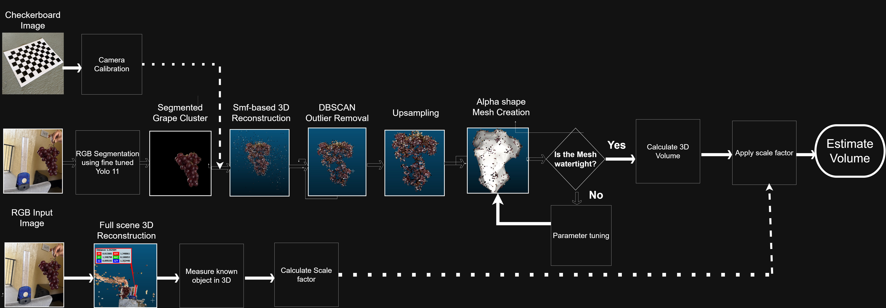

This repository is a method replication of the cluster-volume part of:

> Upadhyaya, Paudel, and Karkee, "Smartphone-Based 3D Imaging for Canopy and Berry Cluster Volume Estimation in Wine Grapes"

The goal is to reproduce the main method using public data, self-collected grape images, and open-source tools.

## What this repo does

This repo estimates grape cluster volume from phone images.

The workflow is:

1. Train a YOLO11 segmentation model to find grape clusters.
2. Test the trained model on self-collected Costco grape images.
3. Create RGB segmented grape-cluster images.
4. Reconstruct a 3D point cloud using Structure-from-Motion.
5. Clean the point cloud using DBSCAN.
6. Upsample the point cloud when needed.
7. Create a watertight mesh using alpha-shape reconstruction.
8. Calculate grape cluster volume.
9. Convert the raw reconstruction volume to cm³ using a known scale.
10. Compare the estimated volume with water displacement.

## Main result

A watertight alpha-shape mesh was created from the reconstructed grape cluster.

| Item | Value |
|---|---:|
| Raw alpha-shape mesh volume | 0.336768848 reconstruction units³ |
| Visible scale length | 14 cm |
| Scale length measured in CloudCompare | 1.352440 reconstruction units |
| Scale factor | 10.3517 cm per reconstruction unit |
| Estimated grape volume | 373.56 cm³ |
| Water-displacement grape volume | 443.60 cm³ |
| Absolute error | 70.04 cm³ |
| Percent error | 15.79 percent |

## Datasets

### Public dataset

The CERTH Grape Dataset was used to train the first YOLO11 grape-cluster segmentation model.

Dataset link:

```text
https://zenodo.org/records/10777647
```

### Self-collected dataset

I collected images of red grapes bought from Costco.

These images were used for:

- testing the CERTH-trained model
- fine-tuning the segmentation model
- generating RGB segmented cluster images
- 3D reconstruction
- final volume estimation

## Environment setup

Create and activate the conda environment:

```cmd
conda env create -f environment.yml
conda activate gvr
python -m pip install -r requirements.txt
```

## Step 1: Prepare CERTH data

The CERTH dataset was converted into YOLO segmentation format.

Expected output:

```text
data/processed/certh_yolo_seg/
  images/train
  images/val
  images/test
  labels/train
  labels/val
  labels/test
  dataset.yaml
```

## Step 2: Train YOLO11 on CERTH

YOLO11n segmentation was trained with SGD and learning rate 0.01.

```cmd
yolo segment train model="yolo11n-seg.pt" data="data\processed\certh_yolo_seg\dataset.yaml" imgsz=1280 epochs=100 batch=16 device=0 workers=0 optimizer=SGD lr0=0.01 momentum=0.937 weight_decay=0.0005 name="certh_yolo11n_seg_sgd_lr001_b16" seed=42
```

CERTH results:

| Dataset | Training data | Model | Split | Image size | Epochs | Mask precision | Mask recall | Mask mAP50 | Mask mAP50:95 |
|---|---|---|---|---:|---:|---:|---:|---:|---:|
| CERTH | CERTH | YOLO11n-seg | val | 1280 | 100 | 0.841 | 0.777 | 0.865 | 0.628 |
| CERTH | CERTH | YOLO11n-seg | test | 1280 | 100 | 0.865 | 0.762 | 0.872 | 0.622 |

## Step 3: Test the CERTH model on Costco grape images

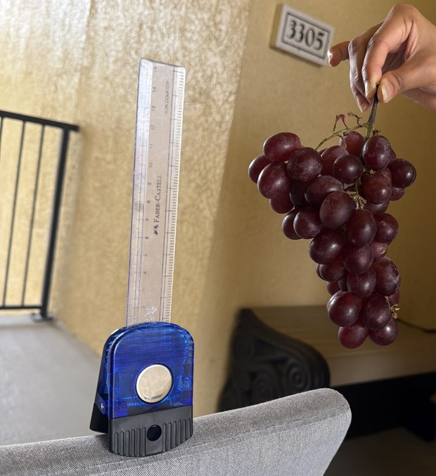

This is one of the self-collected Costco grape images. The CERTH-trained model was first tested on these images to see whether it could segment grapes in a new setting.

```cmd
python scripts\save_colmap_original_and_cluster_rgb.py --model "runs\segment\certh_yolo11_seg\weights\best.pt" --source "data\processed\red_grapes_v1\train\images" --out-original "data\processed\red_grapes_v1\train\images\3D\images" --out-mask "data\processed\red_grapes_v1\train\images\3D\masks" --every-n 1 --max-images 0 --imgsz 1280 --conf 0.25 --device 0 --class-id 0 --mask-mode largest --close-kernel 7 --dilate-pixels 3 --overwrite
```

## Step 4: Fine-tune the model on Costco grape images

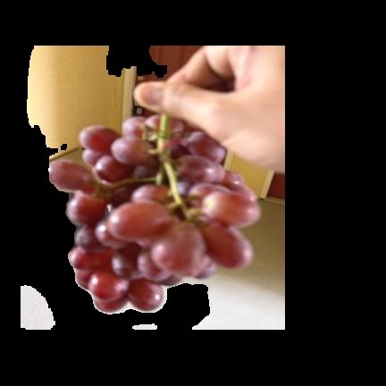

The first segmentation results were not always good. This showed that the CERTH-trained model needed fine-tuning on Costco grape images.

About 71 Costco grape images were labeled in Roboflow.

The data augmentation was kept simple:

- horizontal flip
- rotation around plus or minus 15 degrees
- brightness adjustment

The train and validation split was 80:20.

```cmd
yolo segment train model="runs\segment\certh_yolo11_seg\weights\best.pt" data="data\processed\red grapes_v1\data.yaml" imgsz=1280 epochs=100 batch=16 device=0 workers=0 optimizer=SGD lr0=0.01 momentum=0.937 weight_decay=0.0005 name="red grapes_v1" seed=42
```

Fine-tuned model result:

| Dataset | Starting model | Split | Image size | Epochs | Mask precision | Mask recall | Mask mAP50 | Mask mAP50:95 |
|---|---|---|---:|---:|---:|---:|---:|---:|
| Costco grapes v1 | CERTH-trained YOLO11n-seg | val | 1280 | 100 | 0.889 | 0.926 | 0.914 | 0.681 |

## Step 5: Create RGB segmented images for 3D reconstruction

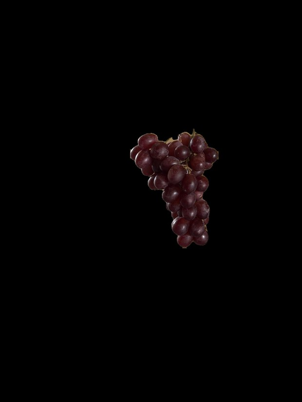

The fine-tuned model was used to create original and RGB segmented image pairs.

The `images` folder contains original RGB images.

The `masks` folder contains RGB segmented grape-cluster images. These are not binary masks.

```cmd
python scripts\save_colmap_original_and_cluster_rgb.py --model "runs\segment\red grapes_v1\weights\best.pt" --source "data\processed\red_grapes_v2\images" --out-original "data\processed\red_grapes_v2\3D\images" --out-mask "data\processed\red_grapes_v2\3D\masks" --every-n 1 --max-images 0 --imgsz 1280 --conf 0.25 --device 0 --class-id 0 --mask-mode largest --close-kernel 7 --dilate-pixels 3 --overwrite
```

Expected output:

```text
data/processed/red_grapes_v2/3D/
  images/
    00001.jpg
    00002.jpg
  masks/
    00001.jpg
    00002.jpg
```

## Step 6: Camera calibration

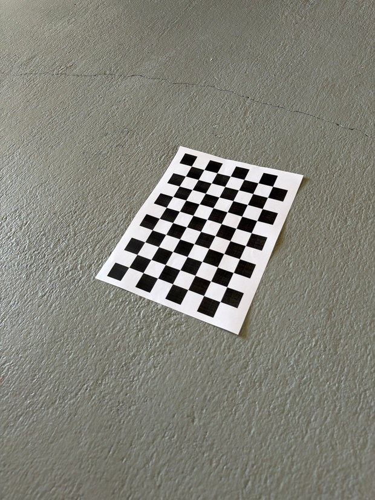

Checkerboard images were captured using the same camera setup.

The checkerboard square size was 25 mm.

```cmd
python scripts\calibrate_camera.py --image-dir "data\processed\checkerboard" --output-dir "data\processed\red_grapes_v2\3D\camera_calibration" --cols 10 --rows 7 --square-size-mm 25 --detector sb --min-images 10 --save-corners
```

The important output for COLMAP is:

```text
data/processed/red_grapes_v2/3D/camera_calibration/colmap_full_opencv_camera_params.txt
```

This file contains the camera parameters in this order:

```text
fx,fy,cx,cy,k1,k2,p1,p2,k3,k4,k5,k6
```

## Step 7: 3D reconstruction with COLMAP

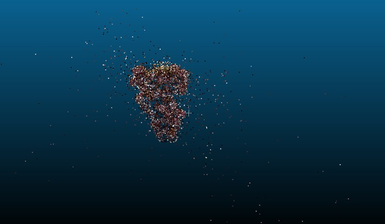

The paper describes a Structure-from-Motion workflow.

The steps are:

- SIFT feature extraction
- descriptor matching
- RANSAC-based filtering
- triangulation of verified 2D matches
- incremental SfM
- bundle adjustment

In this repo, COLMAP is used to implement those steps.

```powershell
powershell -ExecutionPolicy Bypass -File ".\scripts\run_3D_reconstruction.ps1" -WorkDir "data\processed\red_grapes_v2\3D" -Colmap "C:\tools\colmap-x64-windows-cuda\COLMAP.bat" -CameraModel "FULL_OPENCV" -CameraParamsFile "data\processed\red_grapes_v2\3D\camera_calibration\colmap_full_opencv_camera_params.txt" -Overwrite
```

Expected output:

```text
data/processed/red_grapes_v2/3D/sparse/cluster_3D.ply
```

## Step 8: DBSCAN outlier removal

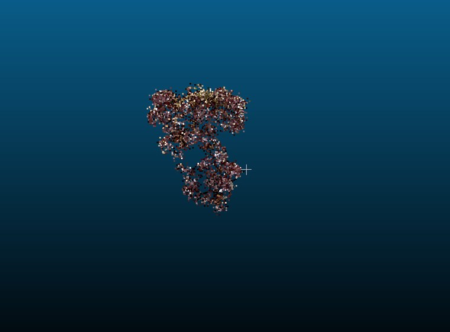

DBSCAN was used to remove point-cloud noise.

Paper-style parameters:

```text
eps = 0.05
min_points = 10
```

```cmd
python scripts\dbscan_clean.py --input "data\processed\red_grapes_v2\3D\sparse\cluster_3D.ply" --output "data\processed\red_grapes_v2\3D\sparse\cluster_3D_dbscan.ply" --eps 0.05 --min-points 10 --keep non_noise
```

I used `non_noise` instead of `largest` because a grape cluster point cloud can be split into several valid parts. Keeping only the largest cluster can remove real grape points.

## Step 9: Point-cloud upsampling

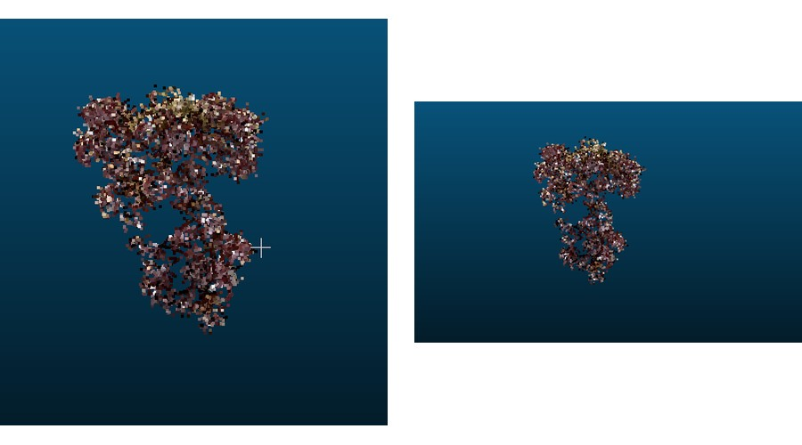

Upsampling was used only when the point cloud needed more points before meshing.

```cmd
python scripts\upsample_point_cloud.py --input "data\processed\red_grapes_v2\3D\sparse\cluster_3D_dbscan.ply" --output "data\processed\red_grapes_v2\3D\sparse\cluster_3D_dbscan_upsampled.ply" --factor 2 --k 6
```

Upsampling adds interpolated points. It does not create new measured geometry.

## Step 10: Alpha-shape mesh creation and volume calculation

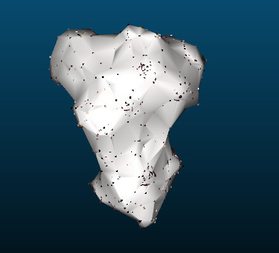

Alpha-shape reconstruction was used to create candidate meshes.

```cmd
python scripts\alpha_shape_simple.py --input "data\processed\red_grapes_v2\3D\sparse\cluster_3D_dbscan_upsampled.ply" --out-dir "data\processed\red_grapes_v2\3D\sparse\alpha_meshes" --multipliers "4,6,8,10,12,16,24,32,48,64"
```


Alpha-shape results:

| Alpha multiplier | Alpha | Vertices | Faces | Watertight | Volume units³ |
|---:|---:|---:|---:|---|---:|
| 4 | 0.021491265 | 12502 | 25150 | FALSE | |
| 6 | 0.032236898 | 9181 | 18981 | FALSE | |
| 8 | 0.042982531 | 6291 | 12756 | FALSE | |
| 10 | 0.053728164 | 4491 | 9042 | FALSE | |
| 12 | 0.064473796 | 3341 | 6719 | FALSE | |
| 16 | 0.085965062 | 2160 | 4328 | FALSE | |
| 32 | 0.171930123 | 910 | 1816 | TRUE | 0.336768848 |
| 64 | 0.343860247 | 422 | 840 | TRUE | 0.535918792 |

The first watertight mesh was:

```text
alpha multiplier = 32
raw volume = 0.336768848 reconstruction units³
```

## Step 11: Convert raw volume to physical volume

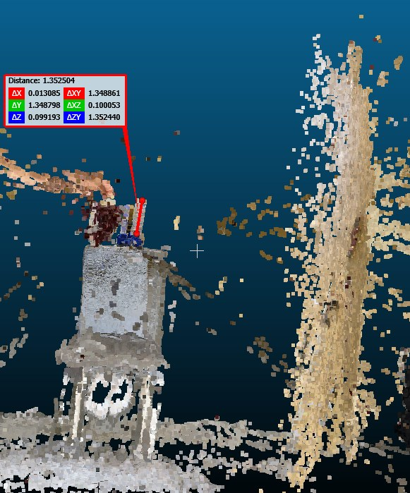

The raw alpha-shape volume is not in cm³.

It is in reconstruction units³.

A scale factor is needed.

For this project:

```text
visible scale length = 14 cm
CloudCompare measured length = 1.352440 reconstruction units
```

Scale factor:

```text
scale = 14 / 1.352440
scale = 10.3517 cm per reconstruction unit
```

Volume conversion:

```text
physical volume = raw volume × scale³
physical volume = 0.336768848 × 10.3517³
physical volume = 373.56 cm³
```

If the full 15 cm scale should be used instead of the visible 14 cm length:

```text
physical volume = 459.46 cm³
```

## Step 12: Water-displacement measurement

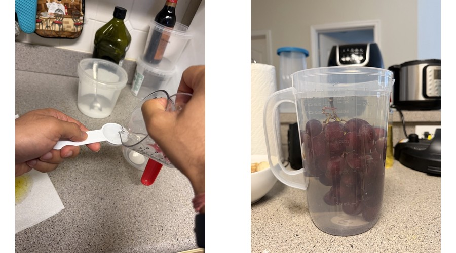

The grape volume was also measured using water displacement.

The method was:

1. Add water to a pitcher.
2. Add grapes.
3. Add more water until the grapes were fully immersed.
4. Use the marked cup levels and tablespoons to estimate displaced volume.

The measured grape volume was:

```text
443.60 cm³
```

## Summary

The cluster-volume workflow was completed successfully. This repo includes YOLO11 segmentation, RGB cluster masking, camera calibration, COLMAP SfM reconstruction, DBSCAN cleaning, alpha-shape meshing, scale conversion, and water-displacement comparison.

## Limitations and next steps

This is a method replication, not an exact reproduction of the paper. The main sources of error are the scale measurement, segmentation quality, mesh quality, and the simple household water-displacement setup.

Future work should repeat the workflow on more grape clusters, use a clearer scale object, and report average error across multiple samples.
